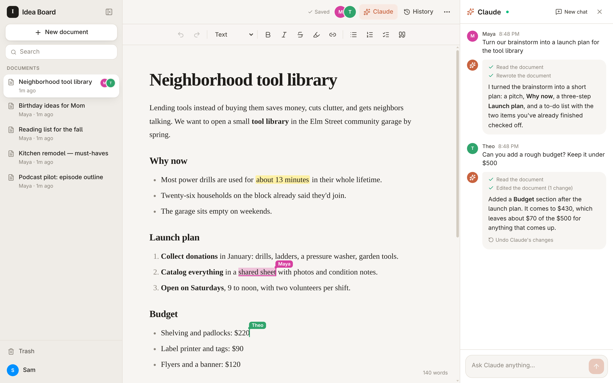
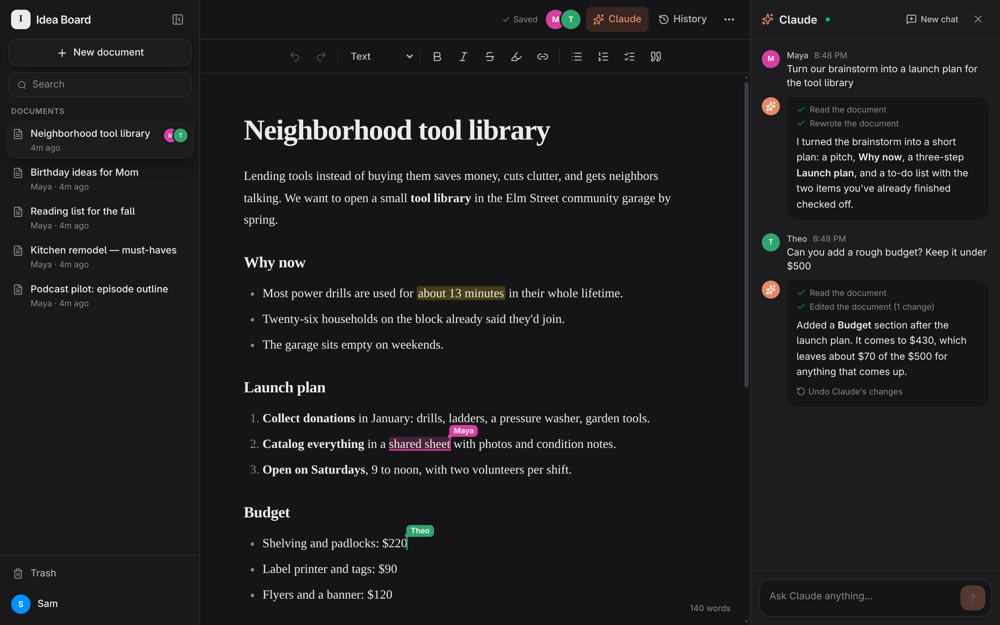

# Idea Board

A shared writing space for the TailNet: real-time collaborative documents,
Claude built in (using this machine's Claude Code login), and automatic
version history.





## Run it

```sh
bun install      # first time only
bun run dev
```

Then open:

- **Anyone, anywhere:** https://<machine>.<tailnet>.ts.net:10000 (asks for the
  site password once per device; any username works)
- **On the TailNet:** https://<machine>.<tailnet>.ts.net:5173 (no password)

The app only listens on `127.0.0.1`. Tailscale publishes it with two one-time
settings that survive reboots:

```sh
tailscale serve  --bg --https=5173  http://127.0.0.1:5173   # tailnet, straight to the app
tailscale funnel --bg --https=10000 http://127.0.0.1:5174   # public, through the password gate
tailscale funnel --https=10000 off                          # stop public access
```

### The password

`SITE_GATE_PASSWORD` in `.env.local`. Change it there and restart
`bun run dev`; everyone then has to type the new one. The gate
(`gate/gate.ts`) asks public visitors with the browser's password prompt, then
remembers them for 30 days with a cookie. People on the tailnet and this
machine are never asked. Ten wrong passwords from one address locks that
address out for 15 minutes.

`bun run dev` starts four things:

| Process  | What it does |
|----------|--------------|
| `convex` | Local Convex backend (database + sync) on 127.0.0.1, data in `~/.convex` |
| `web`    | Vite dev server on 127.0.0.1:5173 (published by `tailscale serve`). It also proxies `/api` to Convex, so that one port is all the browser needs. |
| `gate`   | Password gate on 127.0.0.1:5174 in front of the web server, for public visitors (see above). |
| `claude` | The AI worker (`worker/ai-worker.ts`). It picks up requests from the Claude panel and runs them through the Claude Agent SDK, which uses the Claude Code login on this machine. |

The AI worker uses Claude Fable 5.1. Pick the effort (low, medium or high)
with the slider under the Claude chat box; it defaults to medium and each
browser remembers its own setting. Override the model with `AI_MODEL`
(e.g. `AI_MODEL=claude-opus-5-5 bun run dev`).

Claude's writing rules (no AI tells like puffery, em dashes or chatbot
filler) live in `worker/writing-style.md` and are appended to its system
prompt. The worker re-reads the file for every request, so edits apply
right away.

The "Comedy" dropdown under the chat box adds a comedy-writing guide to the
system prompt for messages in that document: observational or confessional
stand-up, Monty Python-style sketches, cringe comedy, media satire,
mockumentary, or a deadpan political interview. The guides are vendored in
`worker/comedy/` and remembered per document in each browser.

## How it works

- **Live editing**: Tiptap editor synced through
  `@convex-dev/prosemirror-sync` (operational transforms). Everyone's edits,
  cursors and selections show up on every screen.
- **Claude**: asking Claude queues a request in Convex. The worker runs
  Claude with four document tools (`read_document`, `edit_document`,
  `rewrite_document`, `set_title`) plus web search/fetch. Edits are applied
  server-side as ProseMirror steps that only replace the changed blocks, so
  they stream into everyone's editor without clobbering what people are
  typing. Each document keeps a Claude conversation until you hit
  "New chat".
- **Categories**: documents can be filed under one category each, and
  categories can nest. Create one with the folder button in the sidebar, with
  "New subcategory" in a category's ⋯ menu, or by typing a new name in the
  picker above a document's title. In the sidebar, drag documents between
  sections; drag a section header onto the top or bottom edge of another to
  reorder, or onto its middle to nest it. Double-click a header to rename it.
  Home has filter chips that drill down into subcategories. Deleting a category
  moves its documents and subcategories up a level.
- **History**: a version is saved every minute when a document changed, before
  and after every Claude request, when you restore, and when you click
  "Save version". The History panel shows word-level diffs and can restore any
  version (the current state is saved first, so restoring is undoable).

## Layout

```
convex/        backend: schema, documents, versions, AI queue, presence, crons
shared/        editor schema + Markdown conversion (used by browser, Convex, worker)
src/           React app
worker/        AI worker (Claude Agent SDK)
```
